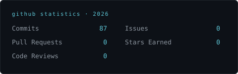
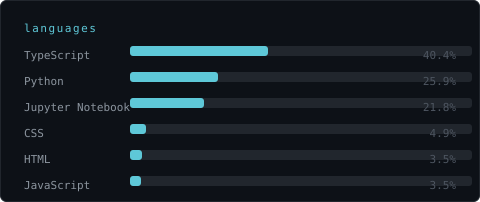
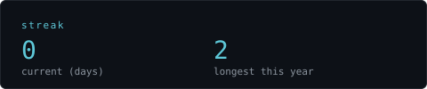
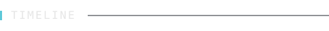
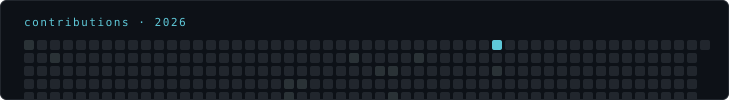

 

**Zaid Bin Naveed** — AI Engineer & Machine Learning Developer.

I build systems across computer vision and large language models, with a
focus on work that has to hold up outside a notebook: reproducible
pipelines, evaluated models, and code someone other than me can run.

> First step to solving a problem is admitting there is one.

 

- AI Research
- Computer Vision
- LLM Projects

Currently completing an AI internship at **FlyRank**, working on applied
ML systems in production.

 

<!--
  FEATURED-PROJECTS: This section is intentionally a template, not
  invented content. Fill in the three to five repositories that should
  represent you, then delete this comment. Each row should link to a
  repo that already has (or will have, per the audit below) a real
  README, not just a folder of scripts.
-->

| Project | Description | Stack |
|---|---|---|
| [`repo-name`](https://github.com/zaidbinnaveed/repo-name) | One line on the problem it solves, not what libraries it imports | e.g. PyTorch, OpenCV |
| [`repo-name`](https://github.com/zaidbinnaveed/repo-name) | — | — |
| [`repo-name`](https://github.com/zaidbinnaveed/repo-name) | — | — |

 

Interests: representation learning for vision, evaluation methodology for
LLMs, and the gap between benchmark performance and deployed behavior.

<!-- Add papers, writeups, or a research statement here as they exist. -->

 

 

 

[LinkedIn](https://www.linkedin.com/in/zaid-bin-naveed-b34559293/) ·
[Portfolio](https://zaid-portfolio-drab.vercel.app/) ·
[Email](mailto:zaidbinnaveed04@gmail.com)

Every asset above is generated by <code>scripts/</code> and refreshed
daily by <a href="./.github/workflows/refresh.yml">GitHub Actions</a> —
no third-party stats widgets.
