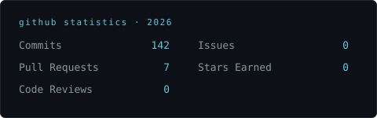
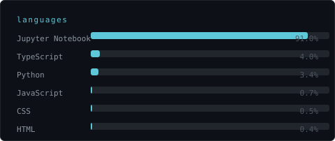
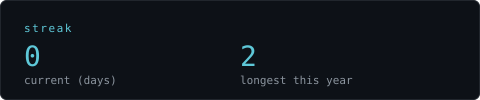
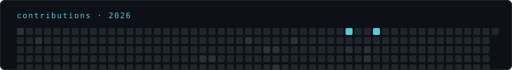

 

### Zaid Bin Naveed

**Artificial Intelligence undergraduate at FAST NUCES Karachi · Machine Learning Intern at FlyRank**

I build applied AI systems across computer vision, recommender systems, information retrieval, and LLM-backed products. I care about the less glamorous parts that make a project credible: explicit constraints, reproducible setup, inspectable evaluation, and an interface that communicates what the system can—and cannot—do.

My current work is centered on turning ML experiments into software another person can run, inspect, and improve.

 

- Building a content-opportunity scoring capstone from Google Search Console performance data at **FlyRank**
- Developing local-first computer-vision prototypes with clearly documented privacy and security limits
- Exploring explainable recommenders, retrieval systems, and streamed LLM product experiences
- Completing a **BS in Artificial Intelligence** at **FAST NUCES Karachi** (2023–2027)

 

| Project | What it demonstrates | Core stack |
|---|---|---|
| [**Cereberus**](https://github.com/zaidbinnaveed/Cereberus) | Local face-gated access prototype with blink liveness, guided enrollment, an operator console, and audit logging | Python, OpenCV, React, Vite |
| [**FlyRank ML Internship**](https://github.com/zaidbinnaveed/FlyRank-ML-Internship) | Reproducible content-opportunity scoring research using search-performance data | Python, Jupyter, pandas, Hugging Face |
| [**HireSense AI**](https://github.com/zaidbinnaveed/HireSense-AI) | Adaptive mock interviews with streamed LLM responses and structured feedback | React, TypeScript, FastAPI, Groq, SSE |
| [**Spidey**](https://github.com/zaidbinnaveed/Spidey) | Parallel depth-limited crawling, a thread-safe inverted index, and a live operations dashboard | Python, FastAPI, React, TypeScript |
| [**Movify**](https://github.com/zaidbinnaveed/Movify) | Explainable content-based and item-to-item movie recommendations | Python, scikit-learn, pandas, TF-IDF |
| [**Derm Nexus AI**](https://github.com/zaidbinnaveed/Derm-Nexus-AI) | Academic image-classification pipeline with training, evaluation, inference, and a web interface | Python, TensorFlow, Next.js, TypeScript |

> These repositories are presented as projects and prototypes at their documented maturity—not as production systems unless the repository says otherwise.

 

### Working toolkit

**Machine learning:** Python · pandas · NumPy · scikit-learn · TensorFlow · Jupyter  
**Applied AI:** Computer vision · Recommender systems · LLM applications · Evaluation · Data pipelines  
**Product engineering:** React · TypeScript · Next.js · FastAPI · REST · Server-Sent Events  
**Delivery:** Git · GitHub Actions · Vercel · Render · Technical documentation

 

### Engineering principles

1. **State the constraint first.** Privacy, latency, data access, and failure modes should shape the solution.
2. **Keep evidence close to the claim.** Setup, architecture, limitations, and evaluation belong beside the code.
3. **Treat UX as part of correctness.** A model output is only useful when a person can understand and act on it.
4. **Prefer honest scope over inflated language.** Prototype, academic project, and production system are different things.

 

  
  

  

 

 

[LinkedIn](https://www.linkedin.com/in/zaid-bin-naveed-b34559293/) ·
[Email](mailto:zaidbinnaveed04@gmail.com) ·
Portfolio available privately on request

The visual assets and repository statistics are generated from this repository and refreshed daily by <a href="./.github/workflows/refresh.yml">GitHub Actions</a>; no third-party statistics widgets are used.
